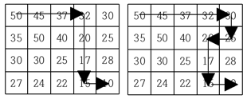

# ❌ BOJ: 1520 내리막 길 (DP / DFS, Gold3)

https://www.acmicpc.net/problem/1520

# 풀이 과정

해당 문제는 DFS 와 DP를 사용한 풀이를 해야 시간초과가 나지 않는다.

dp[i][j] = (i, j) 에서 도착지까지 갈 수 있는 경로의 수

위와 같이 32 에서 도착지까지 갈 수 있는 경우의 수는 2개로 나뉘고, 해당 경우의 수에서 만나는 지점은 20 이다.

20 이후로 나가는 경로는 중복되는 지점으로 하나의 계산을 저장해둬, 꺼내쓰면 연산 횟수를 줄일 수 있다.

# dp 핵심 로직
`
if(dp[r][c] != -1) {
    return dp[r][c];
}
`
위의 코드에서 dp[r][c] 가 이미 계산과정 중 일 때 같은 경로 이므로 해당 인덱스의 반환값을 그대로 가지도록 한다.
